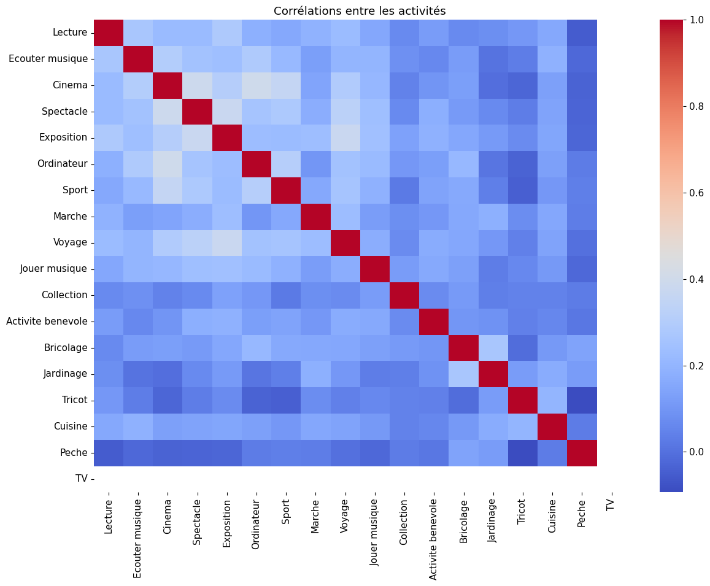
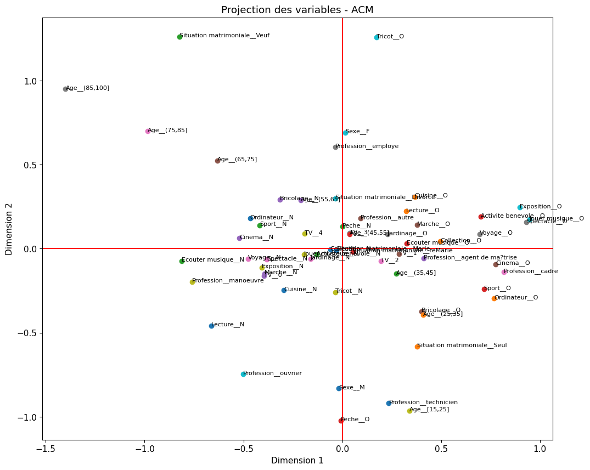

# MCA (ACM) — Projet Loisirs

Ce projet reproduit en Python l'analyse MCA du script R fourni avec visualisations complètes.



## Contenu

**Option 1 : Notebook Jupyter (recommandé pour l'exploration)**
- `mca_loisirs.ipynb` : notebook interactif avec explications et visualisations
  - Installation automatique des dépendances
  - Paramètres modifiables facilement
  - Toutes les figures et résumés statistiques
  - Export des résultats en CSV

**Option 2 : Script Python (pour automatisation)**
- `mca_loisirs.py`: script exécutable (ligne de commande)
- `requirements.txt`: dépendances Python

## Prérequis

- Python 3.8+
- Pip (gestionnaire de paquets)

## Installation rapide

### 1. Créer un environnement virtuel (PowerShell)

```powershell
python -m venv .venv
.\.venv\Scripts\Activate.ps1
pip install --upgrade pip
pip install -r requirements.txt
```

## Utilisation

### Option 1 : Notebook Jupyter (Recommandé)

```powershell
# (Assurez-vous que l'environnement virtuel est activé)
jupyter notebook mca_loisirs.ipynb
```

**Étapes dans le notebook :**
1. Installer les dépendances (première cellule)
2. Charger le CSV (modifier le chemin si nécessaire)
3. Exécuter les analyses et visualisations
4. Ajuster les paramètres `QUALI_SUP_INDICES` et `QUANTI_SUP_INDEX` selon votre dataset
5. (Optionnel) Exporter les résultats en CSV

**Avantages du notebook :**
- Paramètres facilement modifiables
- Exécution progressive et interactive
- Visualisations inline
- Documentation intégrée

### Option 2 : Script Python

Placer le fichier `AnaDo_JeuDonnees_Loisirs.csv` dans le même dossier (ou indiquez son chemin) :

```powershell
python mca_loisirs.py --csv AnaDo_JeuDonnees_Loisirs.csv --quali-sup 19 20 21 22 --quanti-sup 23
```

**Options du script :**
- `--csv` (requis) : chemin du fichier CSV
- `--sep` : séparateur CSV (défaut : `;`)
- `--encoding` : encodage du fichier (défaut : `utf-8`)
- `--quali-sup` : indices 1-bases des variables qualitatives supplémentaires
- `--quanti-sup` : indice 1-base de la variable quantitative supplémentaire
- `--out-dir` : dossier de sortie pour les figures (défaut : `plots`)

## Résultats

**Avec le notebook :**
- Visualisations inline (figures PNG intégrées)
- Résumés statistiques détaillés
- Export optionnel en CSV :
  - `row_coordinates.csv` (coordonnées des individus)
  - `column_coordinates.csv` (coordonnées des catégories)
  - `inertia.csv` (inerties par dimension)

**Avec le script Python :**
- Figures PNG sauvegardées dans le dossier `plots/` :
  - `mca_eigenvalues.png`
  - `mca_individuals_dim1_dim2.png`
  - `mca_individuals_dim2_dim3.png` (si disponible)
  - `mca_categories_dim1_dim2.png`
  - `mca_ellipses.png` (si variable groupe disponible)
  - `mca_quanti_sup_corrs.png` (si variable quantitative suppl. fournie)

## Ajustement des paramètres

Le fichier R original utilise :
- `quali.sup = 19:22` → indices 1-based pour variables qualitatives supplémentaires
- `quanti.sup = 23` → indice 1-base pour variable quantitative supplémentaire

**Si votre dataset a une structure différente :**
1. **Avec le notebook** : modifiez directement `QUALI_SUP_INDICES` et `QUANTI_SUP_INDEX` dans la cellule 5
2. **Avec le script** : ajustez les paramètres `--quali-sup` et `--quanti-sup` en ligne de commande

## Notes

- Le package `prince` implémente la MCA, l'équivalent Python de `FactoMineR::MCA()` en R
- Les colonnes texte sont converties automatiquement en catégories
- `adjustText` améliore la lisibilité des labels sur le plan factoriel
- Tous les graphes sont reproduits conformément au script R fourni
